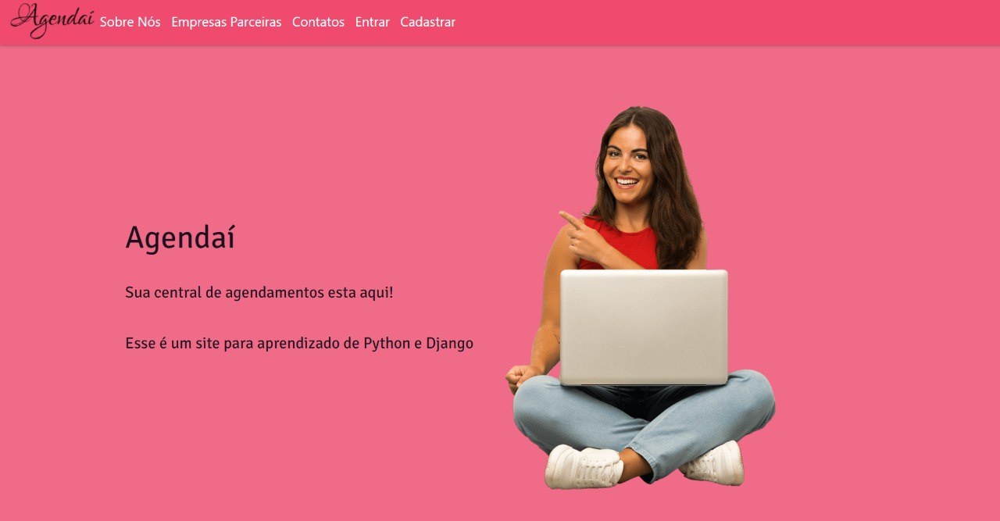

<a name="readme-top"></a>
<!--
*** Obrigado por verificar o Readme do Agendai, qualquer sugestão para melhoria ou problemas, por favor entre em contato conosco.
-->

[![Contributors][contributors-shield]][contributors-url]
[![Forks][forks-shield]][forks-url]
[![Stargazers][stars-shield]][stars-url]
[![Issues][issues-shield]][issues-url]
[![MIT License][license-shield]][license-url]


<br />
<div align="center">
  <a href="https://github.com/jvrfuck/Projeto">
    
  </a>

<h3 align="center">Agendaí</h3>

  <p align="center">
    Sua Central de Agendamento está aqui 
    <br />
    <a href="https://github.com/jvrfuck/Projeto"><strong>Explore o Projeto»</strong></a>
    <br />
    <br />
    <a href="https://github.com/jvrfuck/Projeto">View Demo</a>
    ·
    <a href="https://github.com/jvrfuck/Projeto/issues">Reporte Bugs</a>
    ·
  </p>
</div>


<details>
  <summary>Índice</summary>
  <ol>
    <li>
      <a href="#sobre-o-projeto">Sobre o Projeto</a>
      <ul>
        <li><a href="#tecnologia-utilizada">Tecnologia Utilizada</a></li>
      </ul>
    </li>
    <li>
      <a href="#inicializando-o-projeto">Inicializando o Projeto </a>
      <ul>
        <li><a href="#instalação">Instalação</a></li>
        <li><a href="#pré-requisitos">Pré-requisitos</a></li>
      </ul>
    </li>
    <li><a href="#agendaí-em-uso">Agendaí em Uso</a></li>
    <li><a href="#roteiro">Roteiro</a></li>
    <li><a href="#licença">Licença</a></li>
    <li><a href="#contato">Contato</a></li>
    <li><a href="#agradecimentos">Agradecimentos</a></li>
  </ol>
</details>


## Sobre o Projeto

[![agendai][agendai.shield]][agendai-url]

<p align="center">

</p>

Criação de um site/aplicação web para agendamento de horários (sejam consultas, procedimentos em salões de beleza ou reserva de espaços como academias ou salões de festa). 

Sistema com cadastro de usuários (log in, senha, perfil).

Utilizaremos ferramentas de back e front-end em python, como Django, assim como javascript, html, css e utilização de banco de dados relacionais entre clientes e fornecedores de serviços.

<p align="right">(<a href="#readme-top">Voltar ao Top</a>)</p>


### Tecnologia Utilizada

* [![Python][Python.shield]][Python-url]
* [![VisualCode][VisualCode.shield]][VisualCode-url]
* [![Bootstrap][Bootstrap.shield]][Bootstrap-url]
* [![Java-Script][Java-Script.shield]][Java-Script-url]
* ![CSS][CSS.shield]
* [![GitHub][GitHub.shield]][GitHub-url]
* [![Mysql][Mysql.shield]][Mysql-url]
* [![git][git.shield]][git-url]
* ![Html][Html.shield]
* [![trello][trello.shield]][trello-url]
* [![Heroku][Heroku.shield]][Heroku-url]
* [![Sqlite][Sqlite.shield]][Sqlite-url]
* [![Figma][Figma.shield]][Figma-url]
* [![Django][Django.shield]][Django-url]

<p align="right">(<a href="#readme-top">Voltar ao Top</a>)</p>


## Inicializando o Projeto 

Para colocar uma cópia em execução na sua maquina local, siga as etapas abaixo.


### Instalação

1. Clone o Repositorio
   ```sh
   git clone https://github.com/jvrfuck/Projeto.git
   ```
2. Criar um Abiente Virtual
   ```sh
   python -m venv venv     
   ```
3. Instale o Requirements.txt
   ```sh
   pip install -r requirements.txt
   ```


### Pré-requisitos

Para fazer alterações no projeto Agendaí , entrar em contato com a equipe de desenvolvimento para obter as senhas necessarias.

* .Env 
    ou
* .Local_settings

<p align="right">(<a href="#readme-top">Voltar ao Top</a>)</p>


## Agendaí em Uso

Use this space to show useful examples of how a project can be used. Additional screenshots, code examples and demos work well in this space. You may also link to more resources.

_For more examples, please refer to the [Documentation](https://example.com)_

<p align="right">(<a href="#readme-top">Voltar ao Top</a>)</p>


## Roteiro

- [x] Cadastro de Clientes
    - [x] Banco de Dados Relacionados
- [x] Cadastro de Empreasas
    - [x] Banco de Dados Relacionados
- [x] Cadastro de Horarios
- [x] Agendamentos de Horarios
    - [x] Banco de Dados Relacionados
    - [x] Confirmaçao automatica de Email
- [x] Autenticaçao Social (via google)
- [x] Automatizaçao de Emails

- [ ] Forma de Pagamento Online
- [ ] Fidelidade ao cliente
- [ ] Controle da Gestao da empresa 
    - [ ] Quanto cada cliente gasta
    - [ ] Quanto cada profissional recebe 


<p align="right">(<a href="#readme-top">Voltar ao Top</a>)</p>


## Licença

Distribuído sob a licença MIT. Veja `LICENSE` para mais informações.

<p align="right">(<a href="#readme-top">Voltar ao Top</a>)</p>


## Contato

 [![Email][Email.shield]][Email-url]

 [![Whats][Whats.shield]][Whats-url]

<p align="right">(<a href="#readme-top">Voltar ao Top</a>)</p>


## Agradecimentos

À instituição de ensino Entra21 BlueSoft,contribuiu de maneira essencial para o processo de formação profissional, pelo fornecimento de dados e materiais que foram fundamentais para o desenvolvimento da pesquisa que possibilitou a realização deste Projeto.

[![entra21][entra21.shield]][entra21-url]

Quero agradecer a todos os professores do Entra21, especialmente ao seu orientador de Python, prof. Adriano Machado. Obrigado mestre por exigir mais do que nos acreditavamos que seriamos capazes de realizar. Deixamos aqui nossa eterna gratidão pelo compartilhamento de seu conhecimento e tempo, bem como sua amizade.

[![Adrianowpp][Adrianowpp.shield]][Adrianowpp-url]
[![Adrianoemail][Adrianoemail.shield]][Adrianoemail-url]
[![Adrianolink][Adrianolink.shield]][Adrianolink-url]

<p align="right">(<a href="#readme-top">Voltar ao Top</a>)</p>


## Autores 

<div align="center"> 

[![clayson][clayson.shield]][Clayson-url]
[![douglas][douglas.shield]][douglas-url]
[![jessica][jessica.shield]][jessica-url]
[![joao][joao.shield]][joao-url]
[![rogerio][rogerio.shield]][rogerio-url]

<!-- MARKDOWN LINKS & IMAGES -->
<!-- Primeira Parte -->
[contributors-shield]: https://img.shields.io/github/contributors/jvrfuck/Projeto.svg?style=for-the-badge
[contributors-url]: https://github.com/jvrfuck/Projeto/network/dependencies
[forks-shield]: https://img.shields.io/github/forks/jvrfuck/Projeto.svg?style=for-the-badge
[forks-url]: https://github.com/jvrfuck/Projeto/network/members
[stars-shield]: https://img.shields.io/github/stars/jvrfuck/Projeto.svg?style=for-the-badge
[stars-url]: https://github.com/jvrfuck/Projeto/stargazers
[issues-shield]: https://img.shields.io/github/issues/jvrfuck/Projeto.svg?style=for-the-badge
[issues-url]: https://github.com/jvrfuck/Projeto/issues
[license-shield]: https://img.shields.io/github/license/jvrfuck/Projeto.svg?style=for-the-badge
[license-url]: https://github.com/jvrfuck/Projeto/blob/main/LICENSE
[agendai.shield]: https://img.shields.io/badge/Agenda%C3%AD-%23430098.svg?style=for-the-badge&logo=heroku&logoColor=white
[agendai-url]: http://agendaieletronica.herokuapp.com/

<!-- Segunda Parte -->
[Python.shield]: https://img.shields.io/badge/Python-0769AD?style=for-the-badge&logo=Python&logoColor=white
[Python-url]: https://www.python.org/
[VisualCode.shield]: https://img.shields.io/badge/Visual%20Studio%20Code-0078d7.svg?style=for-the-badge&logo=visual-studio-code&logoColor=white
[VisualCode-url]: https://code.visualstudio.com/
[Bootstrap.shield]: https://img.shields.io/badge/Bootstrap-563D7C?style=for-the-badge&logo=bootstrap&logoColor=white
[Bootstrap-url]: https://getbootstrap.com
[Java-Script.shield]: https://img.shields.io/badge/javascript-%23323330.svg?style=for-the-badge&logo=javascript&logoColor=%23F7DF1E
[Java-Script-url]: https://www.javascript.com/
[CSS.shield]: https://img.shields.io/badge/css3-%231572B6.svg?style=for-the-badge&logo=css3&logoColor=white
[GitHub.shield]: https://img.shields.io/badge/github-%23121011.svg?style=for-the-badge&logo=github&logoColor=white
[GitHub-url]: https://github.com/
[Mysql.shield]: https://img.shields.io/badge/mysql-%2300f.svg?style=for-the-badge&logo=mysql&logoColor=white
[Mysql-url]: https://www.mysql.com/
[Html.shield]: https://img.shields.io/badge/html5-%23E34F26.svg?style=for-the-badge&logo=html5&logoColor=white
[git.shield]: https://img.shields.io/badge/git-%23F05033.svg?style=for-the-badge&logo=git&logoColor=white
[git-url]: https://git-scm.com/
[trello.shield]: https://img.shields.io/badge/Trello-%23026AA7.svg?style=for-the-badge&logo=Trello&logoColor=white
[trello-url]: https://trello.com/
[Heroku.shield]: https://img.shields.io/badge/heroku-%23430098.svg?style=for-the-badge&logo=heroku&logoColor=white
[Heroku-url]: https://devcenter.heroku.com/
[Sqlite.shield]: https://img.shields.io/badge/sqlite-%2307405e.svg?style=for-the-badge&logo=sqlite&logoColor=white
[Sqlite-url]: https://www.sqlite.org/index.html
[Figma.shield]: https://img.shields.io/badge/figma-%23F24E1E.svg?style=for-the-badge&logo=figma&logoColor=white
[Figma-url]: https://www.figma.com/
[Django.shield]: https://img.shields.io/badge/django-%23092E20.svg?style=for-the-badge&logo=django&logoColor=white
[Django-url]: https://www.djangoproject.com/
[Email.shield]: https://img.shields.io/badge/-Gmail-%23333?style=for-the-badge&logo=gmail&logoColor=white
[Email-url]: mailto:agendaieletronica@gmail.com
[Whats.shield]: https://img.shields.io/badge/WhatsApp-25D366?style=for-the-badge&logo=whatsapp&logoColor=white  
[Whats-url]: https://chat.whatsapp.com/CoJrgWnkgPk5gcZKuy4dky

<!-- Agradecimento -->
[entra21.shield]: https://img.shields.io/badge/Entra21-1B6AC6.svg?style=for-the-badge&logo=gnu-emacs&logoColor=white
[entra21-url]: https://www.entra21.com.br/
[Adrianowpp.shield]: https://img.shields.io/badge/WhatsApp-25D366?style=for-the-badge&logo=whatsapp&logoColor=white 
[Adrianowpp-url]: https://api.whatsapp.com/send/?phone=556792636781&text&type=phone_number&app_absent=0
[Adrianoemail.shield]: https://img.shields.io/badge/Gmail-D14836?style=for-the-badge&logo=gmail&logoColor=white
[Adrianoemail-url]: mailto:adriano@machado.tec.br
[Adrianolink.shield]: https://img.shields.io/badge/Adriano%20Machado-%230077B5.svg?style=for-the-badge&logo=linkedin&logoColor=white
[Adrianolink-url]: https://www.linkedin.com/in/xadrak/


<!-- Autores -->
[clayson.shield]: https://img.shields.io/badge/Clayson%20Nardino-%230077B5.svg?style=for-the-badge&logo=linkedin&logoColor=white
[clayson-url]: https://www.linkedin.com/in/cnardino/
[douglas.shield]: https://img.shields.io/badge/Douglas%20Bitencourt-%230077B5.svg?style=for-the-badge&logo=linkedin&logoColor=white
[douglas-url]: https://www.linkedin.com/in/bitencourtdoug/
[jessica.shield]: https://img.shields.io/badge/-Jessica%20Maros-%230077B5?style=for-the-badge&logo=linkedin&logoColor=white
[jessica-url]: https://www.linkedin.com/in/jessicamaros/
[joao.shield]: https://img.shields.io/badge/-Joao%20Fuck-%230077B5?style=for-the-badge&logo=linkedin&logoColor=white
[joao-url]: https://www.linkedin.com/in/joao-vitor-rios-fuck/
[rogerio.shield]: https://img.shields.io/badge/-Rogerio%20Hanke-%230077B5?style=for-the-badge&logo=linkedin&logoColor=white
[rogerio-url]: https://www.linkedin.com/in/rogeriohanke/